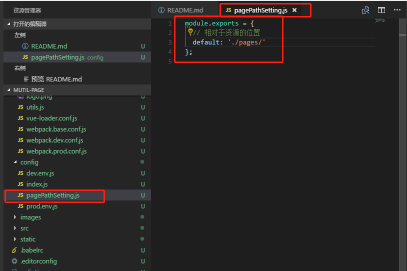
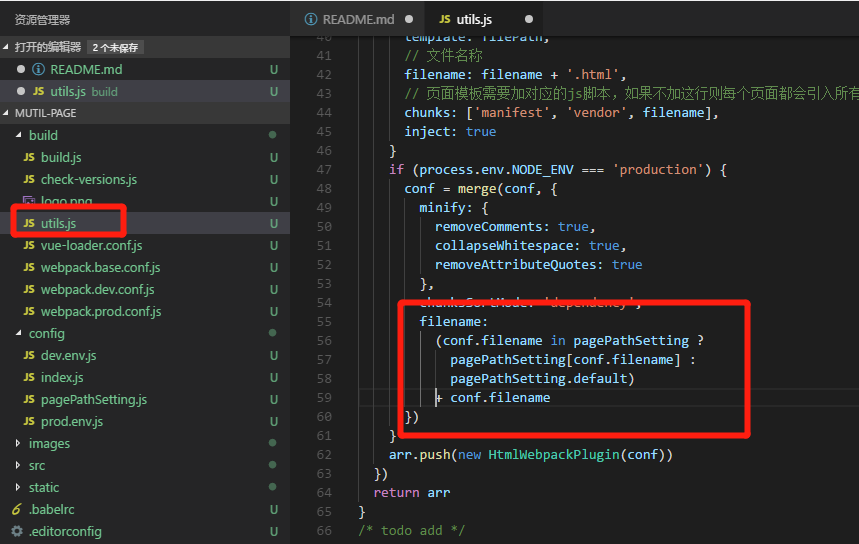

# 多页 vue

## 这里添加了一个页面和资源分开打包的方法

## 配置 ./config/pagePathSetting.js 中的内容即可

```javascript
module.exports = {
    // 这里的 default 是必须配置的
    default: './pages/',
    // 如果不想修改路则使用以下路径
    //default: './'
};

// 另外该工程打包后有 两个 页面
// 分别为 homes.html index.html
// 如果两个页面需要单独配置输出位置则可以写为
module.exports = {
    // 这里的 default 是必须配置的
    default: './pages/',
    "homes.html": './home/',
    "index.html": './index/'
}

// 另外说明一下，这里配置的是相对位置
// 默认 default:'./' 输出的结构应该是
// -dist
//      -static
//      -index.html
//      -homes.html
// 如果配置了 default:'./pages/' 结果为
// -dist
//      -static
//      -pages
//          -index.html
//          -homes.html
// 同理可以使用 ../ 进行偏移

```


