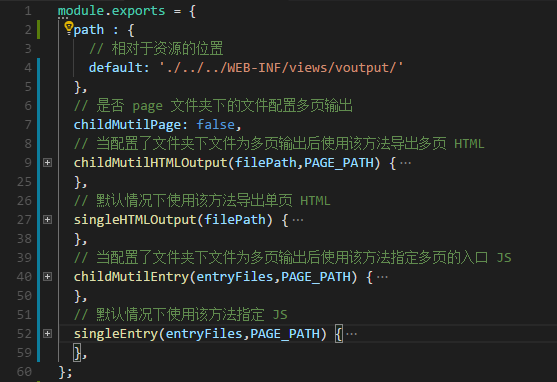

# 多页 vue

- 这里添加了一个页面和资源分开打包的方法

- 配置 ./config/pagePathSetting.js 中的内容即可

```javascript
module.exports = {
    path： {
        // 这里的 default 是必须配置的
        default: './pages/',
        // 如果不想修改路则使用以下路径
        //default: './'
    }
};

// 另外该工程打包后有 两个 页面
// 分别为 homes.html index.html
// 如果两个页面需要单独配置输出位置则可以写为
module.exports = {
    path: {
        // 这里的 default 是必须配置的
        default: './pages/',
        "homes.html": './home/',
        "index.html": './index/'
    }
}

// 另外说明一下，这里配置的是相对位置
// 默认 default:'./' 输出的结构应该是
// -dist
//      -static
//      -index.html
//      -homes.html
// 如果配置了 default:'./pages/' 结果为
// -dist
//      -static
//      -pages
//          -index.html
//          -homes.html
// 同理可以使用 ../ 进行偏移

```

- 关于配置文件夹下多页的打包说明

> * 正常的文件夹结构及打包方法


> * 当配置了文件夹内多页打包时


```javascript
/**
 * 配置【文件夹下多页】的意思
 * 默认情况下
 * page 文件夹中的页面导出为以下结构
 * 例如 page 结构如下
 *    page
 *      -index
 *        -index.vue、index.js、index.html
 *     -windowList
 *        -windowList.vue、windowList.js、windowList.html
 *    -windowCheck
 *        -windowCheck.vue、windowCheck.js、windowCheck.html
 *     -buildingList
 *        -buildingList.vue、buildingList.js、buildingList.html
 *    -buildingCheck
 *        -buildingCheck.vue、buildingCheck.js、buildingCheck.html
 * 生成目录结构
 *    page (文件夹)
 *      -index.html
 *      -windowList.html
 *      -windowCheck.html
 *      -buildingList.html
 *      -buildingCheck.html
 * 但是 有时候 需要 将 windowList、windowCheck 和 buildingList、buildingList 分别统一到 window、check 文件夹下
 *    page
 *      -index
 *        -index.vue、index.js、index.html
 *     -window
 *        -windowList
 *            -windowList.vue、windowList.js、windowList.html
 *        -windowCheck
 *            -windowCheck.vue、windowCheck.js、windowCheck.html
 *     -building
 *        -buildingList
 *            -buildingList.vue、buildingList.js、buildingList.html
 *        -buildingCheck
 *            -buildingCheck.vue、buildingCheck.js、buildingCheck.html
 * 这样子原来的打包 无法 完成，需要将 【childMutilPage】 配置 为 true
 * 并且将生成以下目录结构
 *    page (文件夹)
 *      -index.html
 *      -window (文件夹)
 *          -windowList.html
 *          -windowCheck.html
 *      -building (文件夹)
 *          -buildingList.html
 *          -buildingCheck.html
 * */
```


