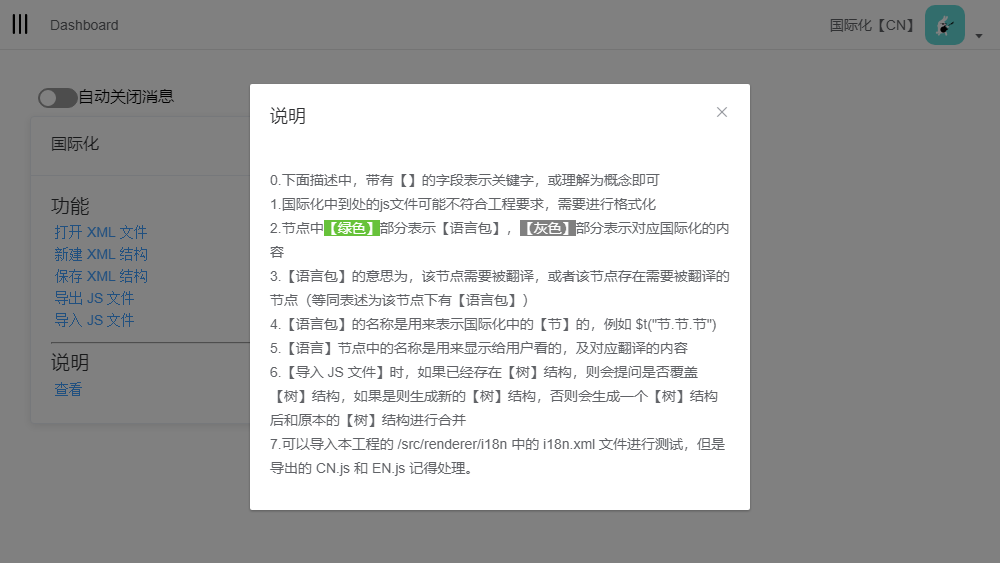

## 说明
### 这个系统主体框架是使用 [SimulatedGREG/electron-vue](https://github.com/SimulatedGREG/electron-vue)

## 文档
* [收获](./doc/收获.md)
* [说明](./doc/说明.md)

## 功能【Function】
* [x] Vue 国际化可视化工具
* [ ] Vue 可视化页面模板生成

## 截图
#### 国际化

