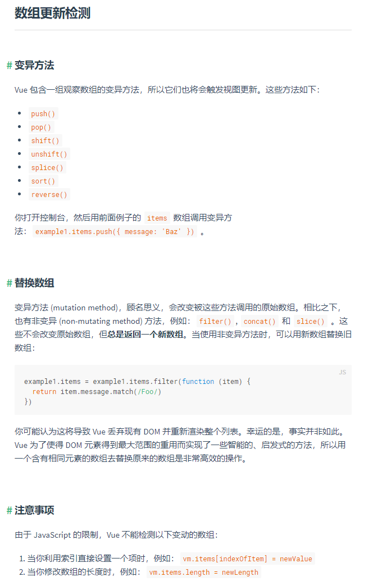
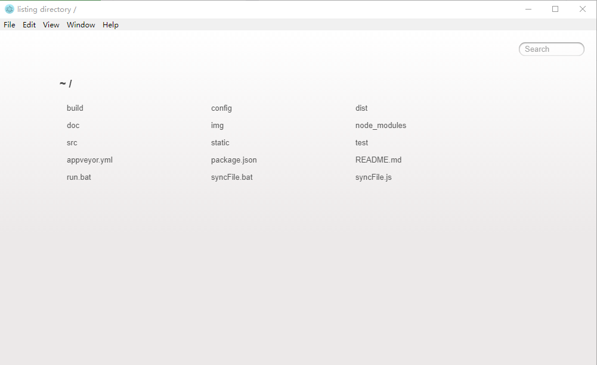
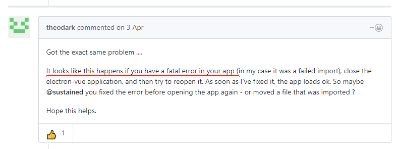

## 在该工程编写过程中的一些收获

* 加载多套 UI 框架时避免污染
```javascript
 /*
    main.js 中不要引入任何框架相关的文件
    在各个页面中如果需要组件再引入，但是部分 UI 框架引入较为麻烦
    例如 YDUI，和 饿了么
 */
```


* 注册一个全局的组建（该组件不为 Vue 文件）

> 并非所有的组件都需要使用到这种方法进行注册，但是如果组件较为特殊则推荐使用该方法，该方法的另一个好处是可以将内容渲染在根节点

```javascript
    /* 1.定义组件 */
    export default {
        name: 'P',
        render(h) {
            return h('p','这是一个作死的 p 组件 而已')
        }
    }
    /* 2.在 main 中注册组件 */
    import P from './~~/P'
    /* Vue 中 组件 名称有大小写区分 */
    Vue.component('P', P)

    /* 使用
    <template>
        <P></P>
    </template>
     */
```

* 动态渲染组件（不建议在正式代码中出现）

> 这里是因为要动态渲染页面的结果，同时也是在动态页面编辑，所以需要使用到该技术

```javascript
    /*
        使用 render 方法进行渲染
        以下方法包含 递归 渲染组件
        如果存在子组件依靠父组件的情况，该组件无法满足
            但是可以使用以下两种方法解决
                1.解耦父子组件关联（iview 和 饿了么 等框架的 tabs 会有父子组件关联问题）
                2.将父子组件定义为一个组件，重新注册该组件（推荐做法）
                    例如重新定义组件为(使用 iview 示例)
                    <template>
                        <Tabs>
                            <TabPane v-for='(tp,ind) in tps' ...>...</TabPane>
                        </Tabs>
                    </template>
    */
    impot * as element from './~~/组件'
    export default {
        name: 'preComponentElement',
        props: {
            code: {
                type: Object,
                required: true
            }
        },
        components: {
            ...element
        },
        render(h) {
            const comps = []
            if (this.code.children) {
                if (this.code.children instanceof Array) {
                    this.code.children.forEach(child => {
                        comps.push(h('preComponentElement', {
                            props: {
                                code: child
                            }
                        }))
                    })
                }
            }
            console.log(comps)
            if (this.code.text) {
                return h(this.code.name, this.code.text, {
                    class: this.code.class,
                    style: this.code.style,
                    attrs: this.code.attrs,
                    props: this.code.props,
                    domProps: this.code.domProps,
                    on: this.code.on,
                    nativeOn: this.code.nativeOn,
                    socpedSlots: this.code.scopedSlots,
                    slot: this.code.slot
                }, comps)
            } else {
                return h(this.code.name, {
                    class: this.code.class,
                    style: this.code.style,
                    attrs: this.code.attrs,
                    props: this.code.props,
                    domProps: this.code.domProps,
                    on: this.code.on,
                    nativeOn: this.code.nativeOn,
                    socpedSlots: this.code.scopedSlots,
                    slot: this.code.slot
                }, comps)
            }
        }
    }

    /* 使用 <component> 组件 */
    /*
        这里 is 后面的名称为已经注册过或存在的组件名称
        <template>
            <div>
                <component :is='"P"'></component>
            </div>
        </template>
    */
````

* 对各个 Vue 加载时使用不同的头部 <meta> 标签

> 这里的使用场景是，部分 UI 框架需要在特定的环境中才能运行，这里使用到了 YDUI ，需要定义移动端的一些适配头

```javascript
    /*
        这部分操作交由路由去完成
        这里的 route 如何定义并不重要，只要在 路由过滤 中可以获取即可
    */
    /* route.js 中定义以下内容 */
    const myRoute = [
        {
            path: 'ydui',
            name: 'vue-editor-ydui',
            component: () => import('@/views/vue-editor/ydui/index'),
            meta: {
                title: 'ydui',
                icon: 'form',
                meta: {
                    viewport: 'width=device-width,initial-scale=1.0,maximum-scale=1.0,user-scalable=0',
                    'apple-mobile-web-app-capable': 'yes',
                    'apple-mobile-web-app-status-bar-style': 'black'
                }
            }
        }
    ]
    /* 在 main 中添加对 route 的过滤 */
    router.beforeEach((to, from, next) => {
      const head = document.getElementsByTagName('head')[0]
      const meta = to.meta.meta
      const metas = document.getElementsByTagName('meta')
      for (var i = 0; i < metas.length; i++) {
        head.removeChild(metas[i])
      }
      if (meta) {
        for (var j in meta) {
          const meta_ = document.createElement('meta')
          meta_.name = j
          meta_.content = meta[j]
          head.appendChild(meta_)
        }
      }
      const meta__ = document.createElement('meta')
      meta__.name = 'charset'
      meta__.content = 'utf-8'
      head.appendChild(meta__)
      next()
    })
```

* 使用外部的 JS 代码和 CSS 代码

> 这里的外部 js 可能不是 Vue 文件也不是 规范的 ES6 代码

```Vue
    <template>
      <div id="app" > </div>
    </template>
    <script src="/外部 js 文件" ></script>
    <script>
    import '外部 css 文件'
    export default {
      name: 'MainPage',
      data () {
        return {
        }
      }
    <style scoped>
      @import '外部 css 文件';
    </style>
```

* 渲染组件时，组件带有 slot 时 render 渲染方法

> 使用 render 渲染时参考[官方文档](https://cn.vuejs.org/v2/guide/render-function.html#%E6%B7%B1%E5%85%A5-data-%E5%AF%B9%E8%B1%A1)

> [查看例子](./example/RenderSlot.html)

```javascript
    /* 注意该组件包含了一个 slot */
    Vue.component('test',{
        template: '<div><slot name="one"></slot></div>'
    });
    Vue.component('forTest',{
        render(h) {
            let a = h('div',{
                // 这里的 one 为 test 组件的插槽名称
                slot: 'one'
            }, 'ibas');
            return h('test',{ /* 各种属性 */ },[a])
        }
    })
```

* [Vue 中的数组操作](https://cn.vuejs.org/v2/guide/list.html#%E5%8F%98%E5%BC%82%E6%96%B9%E6%B3%95)



[MDN 的数组文档](https://developer.mozilla.org/zh-CN/docs/Web/JavaScript/Reference/Global_Objects/Array)

* Vue 启动显示 listing directory / 的原因及解决方法



> 同样出现该问题的 [Github issues](https://github.com/SimulatedGREG/electron-vue/issues/549)


