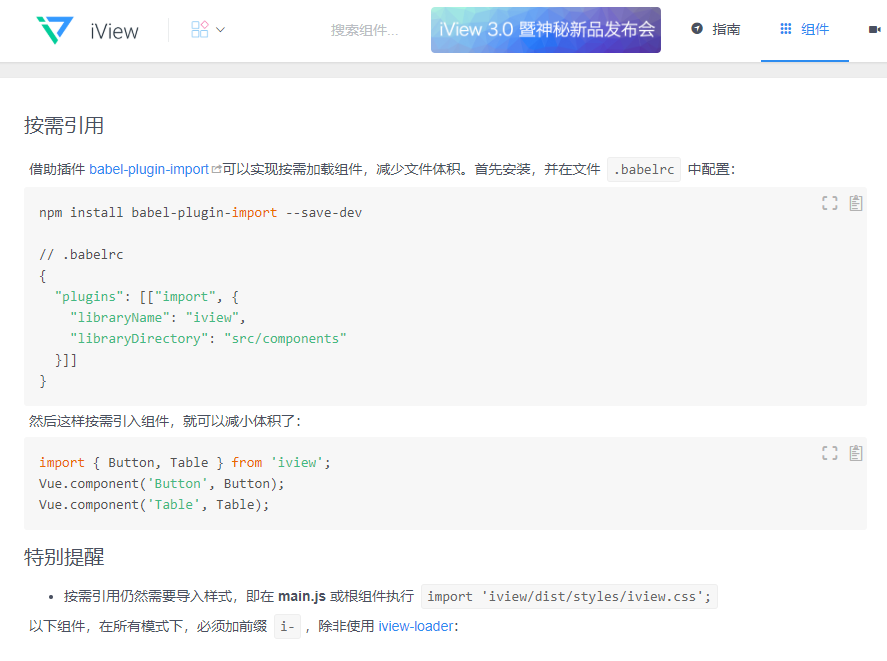
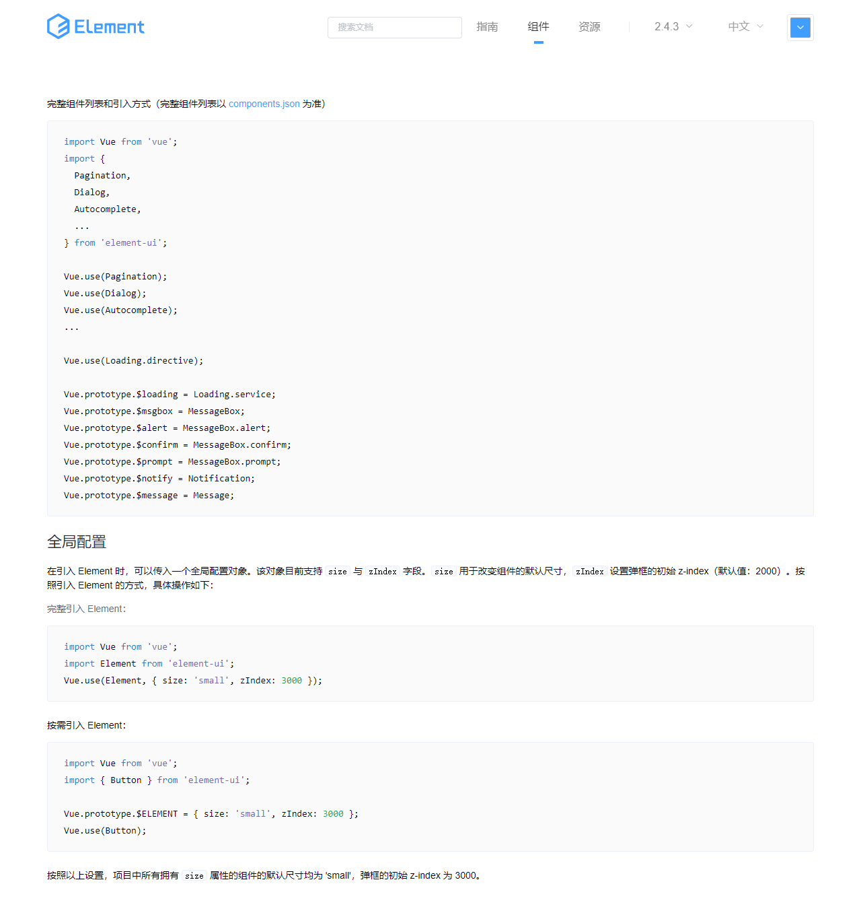
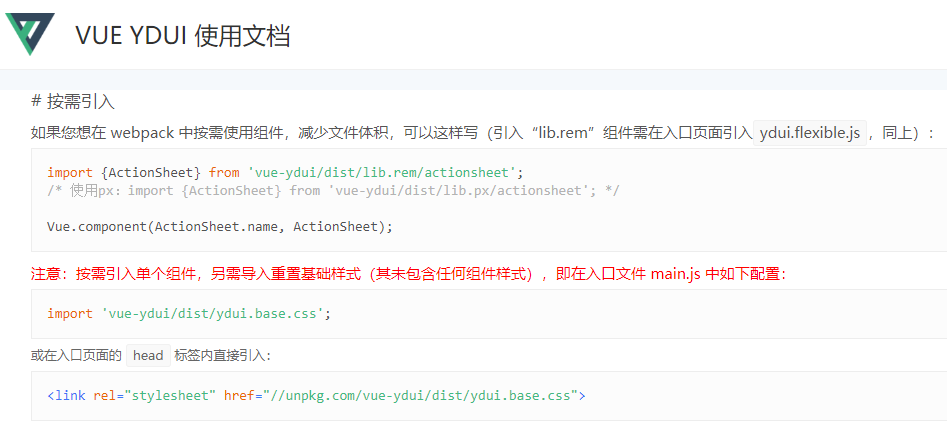

# 框架配置说明

* 关于框架中组件的注册和使用方法

> 组件统一在 main.js 中进行注册
```javascript
// 引入重命名方法
import { renameUIComponent, renameUIUse, installElmAction, installIviewAction } from "./utils/renameUI"
// 引入 饿了么 框架
import * as element from 'element-ui'
renameUIUse(element, 'Elm', Vue)
installElmAction(Vue)
// 引入 iview 框架
import * as iview from 'iview'
renameUIComponent(iview, 'Iv', Vue)
installIviewAction(iview.Message, Vue)
// 引入 Ydui 框架
import { installYdui } from "./template/ydui/importAll"
installYdui(Vue)
```

>> 这里说明一下 [iview](https://www.iviewui.com/docs/guide/start#%E6%8C%89%E9%9C%80%E5%BC%95%E7%94%A8) 和 [饿了么](http://element-cn.eleme.io/#/zh-CN/component/quickstart#yin-ru-element) 和 [ydui](http://vue.ydui.org/docs/#/) 三个框架在注册组件时的差异

>> 

>> 

>> 

>> 另外，由于 iview 和 饿了么 提供了消息组件，这里需要另外注册，饿了么 单组件文档中有描述该部分

>> iview 文档中暂时未找到说明部分，但是在使用 **import iview from 'iview'** 时，可以从 iview 中看到一个属性为 Message

```javascript
// /utils/renameUI.js
import { Loading, MessageBox, Notification, Message } from 'element-ui'
export const installElmAction = (Vue) => {
    Vue.prototype.elm = {
        $loading: Loading.service,
        $msgbox: MessageBox,
        $alert: MessageBox.alert,
        $confirm: MessageBox.confirm,
        $notify: Notification,
        $message: Message
    }
}

// IviewMessage = iview.Message
// IviewNotice = iview.Notice
export const installIviewAction = (IviewMessage, IviewNotice, Vue) => {
    Vue.prototype.iview = {
        $Message: IviewMessage,
        $Notice: IviewNotice
    }
}
```

* 注册后代码中使用各种框架组件时的方法如下

```Vue
<template>
    <div>
        <!-- iview 组件 -->
        <iv-button @click='ivNoti'>iview 按钮</iv-button>
        <!-- 饿了么 组件 -->
        <ElmElButton @click='elmNoti'>饿了么 按钮</ElmElButton>
        <elm-el-button>饿了么 按钮</elm-el-button>
        <!-- ydui 组件 -->
        <yd-button>ydui 按钮</yd-button>
    </div>
    <script>
        export default {
            methods: {
                ivNoti() {
                    this.iview.$Notice.open({
                        title: 'iview 通知',
                        desc: '通知内容',
                        duration: 0
                    })
                },
                elmNoti() {
                    this.elm.$notify({
                        title: '标题',
                        message: '消息内容'
                    })
                }
            }
        }
    </script>
</template>
```


